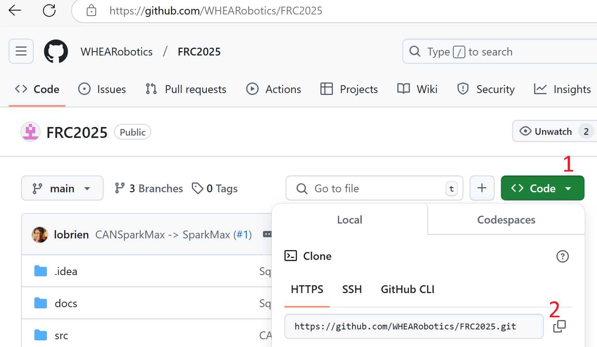
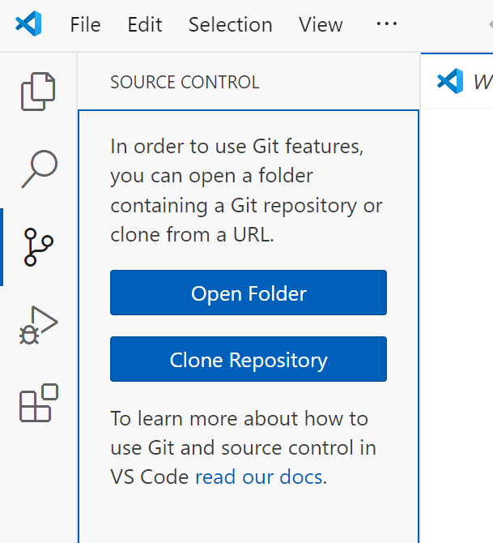
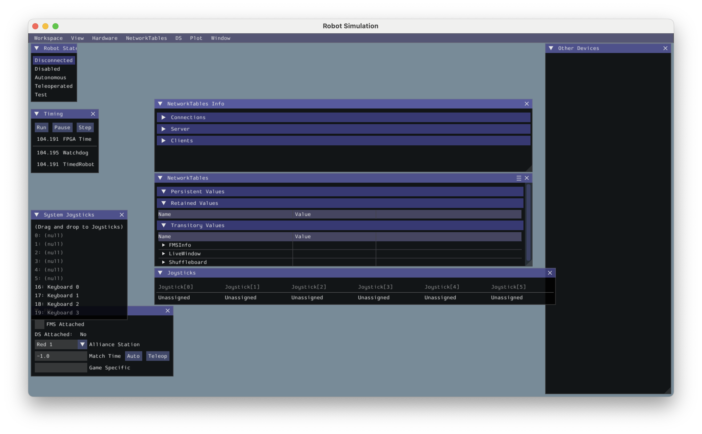

# Install prerequisites 

Robotic team computers likely have a few of these already.

- [Install Python 3.13 or 3.14 on your development computer(s)](https://www.python.org/downloads/)
- [Install VSCode on your development computer(s)](https://code.visualstudio.com/download)
- [Install Git for Windows on your development computers](https://git-scm.com/downloads)
- [Install FRC Game and RobotPy for the present year on your dev computer(s)](https://docs.wpilib.org/en/stable/docs/zero-to-robot/step-2/frc-game-tools.html).  This means uninstalling the old beforehand, as in the instructions.
- [Install the "uv" Python package manager on your dev computer(s)](https://docs.astral.sh/uv/getting-started/installation/)
    - The `uv` developers' preferred way to install on Windows is with a Windows PowerShell command that you can copy from the above link. PowerShell is similar in function to the classic Windows command prompt, but has different command names.  Start it with the Windows button, then "PowerShell".
    - Copy the link and paste it into the PowerShell, hit enter, and it should install.  Afterward, it is OK to close the prompt.

# Clone this repository and set up virtual environment

- In a browser, go to the FRC2026 repository on GitHub.com (you are probably already
there if you are reading this documentation), click on the green "Code" button, and copy the URL to the repository. 



- In VSCode with nothing open, go to the source control tab (the little branching
icon on the left, shown in the image), and click "Clone Repository".  Paste the URL
you copied into the window at the top. 



- Set the destination as the computer's desktop.  VSCode, using git, will make a copy
of the repository to a folder on the desktop called "FRC2026".
- Open a command prompt (Windows button, type "cmd").
- `cd Desktop\FRC2026` to change directory/folder to the new folder.
- `uv sync` will create a "virtual environment" folder named `.venv`
in FRC2026, and then download/install any required Python libraries into that environment.  That will include the robotpy FRC Python library.  It may also download a different version of Python to use in that environment, depending on what is called out in the .python-version file.
- Close the command prompt.
- Open the FRC2026 folder and double-click on the `Start Command Prompt.bat` batch file.  
This should open a new command prompt, and it will have the virtual environment
activated.  You can tell this because the beginning text of the prompt will be "(.venv)".
You might want to make a shortcut to this batch file on the desktop, because you will
be using this virtual environment prompt for much of your work.

# Set up robotpy

- The basic robotpy components were downloaded above by `uv`.
- To get third party libraries for motor controllers and other dependencies like AprilTag code, change the prompt to be in the folder with some robot code, such as the "src\test_motors\" folder with `cd src\test_motors`. Then type `robotpy sync`, or `robotpy --main test_motors.py sync` if the python file is not called `robot.py`.  This will download any other dependencies, including specific files for the roboRIO, using the
`pyproject.toml` file as a reference.  As we develop code over the season, we will
sometimes make changes to this file, and you will have to run `robotpy sync` again.  We also want to keep all the `pyproject.toml` files aligned.


# Check Installation

- Open a terminal using the `Start Command Prompt.bat` batch file.
- Run `robotpy --main src\hello_robot\hello_robot.py sim`

You should see the simulation window:



And in your console you should see something like:

```
10:01:35:647 INFO    : faulthandler        : registered SIGUSR2 for PID 2744
10:01:35:649 INFO    : halsim_gui          : WPILib HAL Simulation 2024.3.2.1
HAL Extensions: Attempting to load: libhalsim_gui
Simulator GUI Initializing.
Simulator GUI Initialized!
HAL Extensions: Successfully loaded extension
10:01:35:767 WARNING : pyfrc.physics       : Cannot enable physics support, /Users/lobrien/Documents/src/FRC/FRC2025/src/hello_robot/physics.py not found
10:01:35:768 INFO    : wpilib              : RobotPy version 2024.3.2.2
10:01:35:768 INFO    : wpilib              : WPILib version 2024.3.2.1
10:01:35:768 INFO    : wpilib              : Running with simulated HAL.
10:01:35:770 INFO    : nt                  : could not open persistent file 'networktables.json': No such file or directory (this can be ignored if you aren't expecting persistent values)
10:01:35:771 INFO    : nt                  : Listening on NT3 port 1735, NT4 port 5810
Not loading CameraServerShared
Success

********** Robot program startup complete **********
2024-12-24 10:01:35.791 Python[2744:71983881] +[IMKClient subclass]: chose IMKClient_Modern
2024-12-24 10:01:35.791 Python[2744:71983881] +[IMKInputSession subclass]: chose IMKInputSession_Modern
Default DisabledPeriodic() method... Override me!
Default RobotPeriodic() method... Override me!
Default SimulationPeriodic() method... Override me!

```
Close the simulation GUI window to stop the simulation. Congratulations! You have successfully installed the FRC tools and dependencies for this project.


### Troubleshooting Installation

If you do not see the simulation window, or if you see an error message, please check the following:

- Were you in a command prompt window with an activated virtual environment before running `robotpy`?

If you see an error message like `command not found: robotpy`, then you may need to install the `robotpy` command line tool.

- Did you run `robotpy` from the root directory of this repository?

If you see an error message like `ERROR: /src/hello_robot/hello_robot.py does not exist`, then you may not be in the root directory of this repository.

    - If you are running a Windows Command or Powershell prompt, check which directory you are in by running `dir`. 
    - If you are running a Unix shell, check which directory you are in by running `pwd`.

- Did you see any error messages when you ran either `uv sync` or `robotpy sync`?

If you see an error message like `ERROR: Could not find a version that satisfies the requirement ...`, then you may have a network connectivity issue. 

- Check your network connection

- Did you see any error messages when you ran `robotpy`?


# Maintaining the installation during development

## Procedures

If we need new general-purpose Python libraries during development, or a new version of robotpy is released, we'll need to update all the computers and eventually the robot.  

On the first computer:

1. Pull from the GitHub repository so you are working with the latest state of the code.
2. Edit `pyproject.toml` file to change the robotpy version in the "dependencies" section, and also in the "robotpy_version" field under "tool.robotpy".
3. Or if we need new python library, add it to the "dependencies" section.  For example, if we needed the `requests` library because we were going to make some web calls (unlikely on the robot), add "requests" in that section.
4. Start a new command prompt in the virtual environment, as described above.
5. Execute `uv sync` to update the virtual environment.  This will also make changes to the `uv.lock` file that uv uses to keep track of things.
6. Copy the `pyproject.toml` file to all the robot code folders we have in the `src` folder (more explanation below).  We want all these to have the same contents (more explanation below).
7. Change to a robot code folder/directory with `cd src\<foldername>`, for example `cd src\test_motors`.
8. Execute robotpy sync to get the extra dependencies needed for the laptop and the roboRIO.

  - If the code file is called `robot.py`, you can use `robotpy sync`.
  - If the code file is something else, like `test_motors.py`, then use `robotpy --main test_motors.py sync`.

9. Test the update in an appropriate way to give some confidence that things are working.  Simulate, deploy code to a robot, etc.

10. Commit the changes to the `pyproject.toml` files and `uv.lock`, and push them to the GitHub account.

On the rest of the computers:

- Pull the changes from GitHub.
- Do steps 4, 5, 7, and 8 above to update the environment.


## Some explanation

This procedure is a bit cumbersome; here are the reasons.

"uv" is useful because it combines managing virtual environments and the Python packages installed within them.  It helps every developer on a team have the same environment and thus minimize the "but it works on my computer" problem.

"robotpy" is the official implementation of the FRC libraries for Python.  But in addition to the libraries, it includes some commands that simplify getting the code onto your computer and the robot.  These commands have some assumptions built in:

- `robotpy sync` and `robotpy deploy` (when the latter is changing libraries on the roboRIO) expect `pyproject.toml` to exist in the **same** folder as the robot.py file in order to get/deploy the extra libraries for REV and CTRE/phoenix6 motor controllers as well as Apriltag and the commands2 framework.  This is perfect if you just have one `robot.py` code at the top level of your repository.  In our case with multiple `src\<foldername>\robot.py` robot files for different purposes (testing motors, vision, etc.), it is possible to your command prompt in an activated environment at the top level folder and execute `robotpy --main src\hello_robot\hello.py sync` (or deploy), and it will sync/deploy some stuff, but not the components/requires fields.  "import phoenix6" will fail when executing on the robot.

- `robotpy deploy` uploads everything in the folder containing the robot.py file onto the roboRIO. For us, that means that if we had `robot.py` at the top level folder, deploying also loads all the documentation files onto the robot.  This file isn't a problem because it is small, but the images, unnecessarily take up space and slow deployment.

The solution for now is to have a top-level `pyproject.toml` and to execute `uv` when in that folder.  This also manages the virtual environment and keeps its folder at the top level.  When we `robotpy sync` and `robotpy deploy`, we do it in one of the program folders (`src\<foldername>\robot.py`), using the program folder copy of `pyproject.toml`.  This avoids loading the documentation onto the roboRIO.
